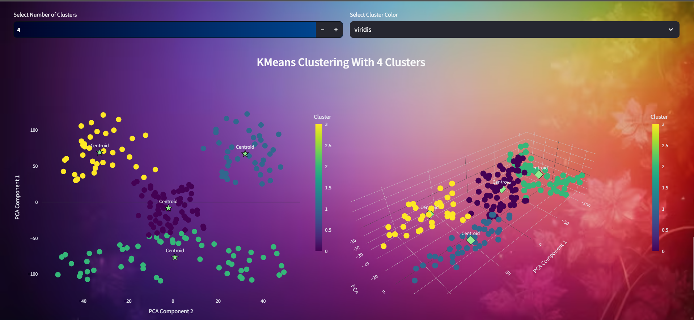

# **Automated Market Segmentation**

## **Project Overview**

This project focuses on **Automated Market Segmentation**, aiming to streamline the process of identifying and profiling different customer segments within a dataset. By using machine learning and AI tools, this project provides a scalable solution for businesses to understand their market segments, enabling them to craft more targeted marketing strategies and improve customer experiences.

## Screenshots

  
  
  
  
  
  
  
  
  
  

## **Features**

- **Data Cleaning & Preprocessing**:
  - Handling missing data by providing options to drop or impute values for both numerical and categorical features.
  - Type casting and feature scaling to prepare the data for analysis.

- **Market Segmentation**:
  - **KMeans Clustering**: Implementation of KMeans clustering with features like plotting the WCSS (Within-Cluster Sum of Squares) and Silhouette scores to determine the optimal number of clusters.
  - **PCA (Principal Component Analysis)**: Dimensionality reduction to visualize clusters in 2D and 3D spaces.
  - **Cluster Visualization**: Using Seaborn and Matplotlib to plot clusters and centroids for visual insights.

- **Profiling Segments**:
  - Grouping data by clusters and categorical features.
  - Generating detailed segment profiles using AI, with insights into behavioral, demographic, geographic, and psychographic segmentation.
  - Summarizing key findings to highlight significant differences between clusters.

- **Streamlit Integration**:
  - A user-friendly interface for performing data cleaning, segmentation, and visualization tasks.
  - Options to customize the appearance of the app, including background images, text colors, and gradients.

### **Usage**
1. **Data Upload**: Upload your dataset through the Streamlit app.
2. **Data Cleaning**: Handle missing values, type cast columns, and apply feature scaling.
3. **Segmentation**: Choose the number of clusters and perform KMeans clustering.
4. **Profiling Segments**: Generate detailed segment profiles using AI and visualize the clusters.
5. **Download Reports**: Export the segmented data and profiles for further analysis.

## **Demo**
[https://www.linkedin.com/posts/harshitpathak18_python-segmentation-marketanalysis-activity-7228770119911358464-hypV?utm_source=share&utm_medium=member_desktop]

## **Technical Details**

### **Clustering Algorithm**
- **KMeans**: A popular unsupervised learning algorithm that partitions the dataset into K distinct clusters based on feature similarity.

### **AI Integration**
- **Google Generative AI Gemini-1.5 Model**: Used for generating natural language summaries and insights based on the segmented clusters.

### **Data Visualization**
- **Seaborn & Matplotlib**: Libraries used for plotting clusters, centroids, and other visual elements in the Streamlit app.
- **Plotly Express**: Used for interactive visualizations like WCSS plots.

## **Challenges & Solutions**
- **Handling Large Datasets**: Implemented efficient data processing techniques and optimized the AI prompt generation to reduce computational overhead.
- **Real-time Profiling**: Used a spinner to enhance user experience while generating AI-powered segment profiles.
- **Customization**: Provided extensive customization options in the Streamlit app to allow users to tailor the appearance and functionality to their needs.

## **License**
This project is licensed under the MIT License. See the [LICENSE](LICENSE) file for more details.

## **Acknowledgments**
- Special thanks to the open-source community for providing the tools and libraries that made this project possible.
- Inspired by real-world market segmentation challenges faced by small businesses.
